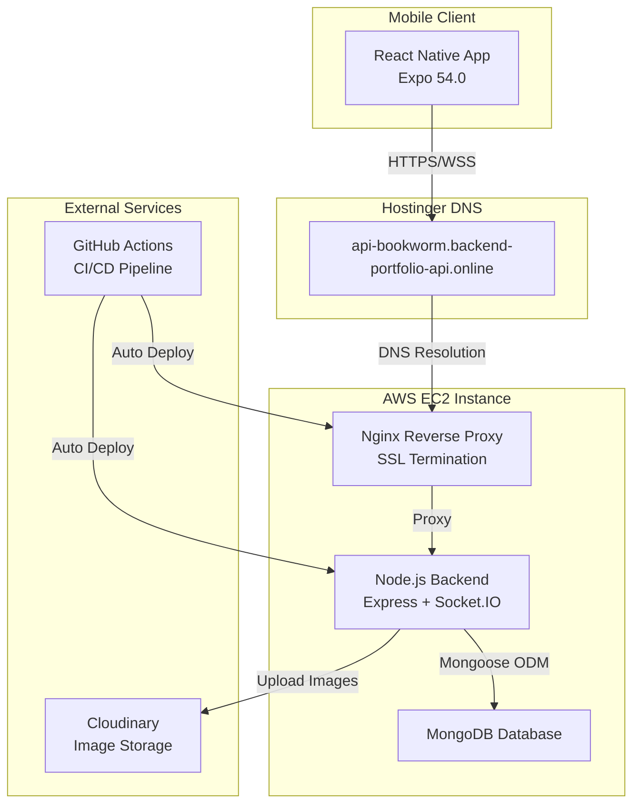
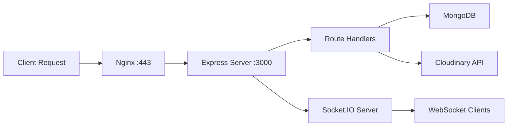

# 📚 Readsphere - Social Reading & recommending Platform

<div align="center">


**A feature-rich social reading platform that brings book lovers together**

[](https://github.com/vedchaudhari/rn-bookworm/actions/workflows/backend.yml)
[](https://reactnative.dev/)
[](https://expo.dev/)
[](https://nodejs.org/)
[](https://www.mongodb.com/)

[Features](#-features) • [Tech Stack](#-tech-stack) • [Architecture](#-architecture) • [Getting Started](#-getting-started) • [Deployment](#-deployment)

</div>

---

## 📖 About

**Readsphere** is a comprehensive mobile-first social reading platform that allows users to discover, share, and discuss books with a vibrant community. Built with modern technologies and best practices, it combines the joy of reading with social networking features, real-time messaging, gamification, and personalized recommendations.

**Live API:** [https://api-bookworm.backend-portfolio-api.online](https://api-bookworm.backend-portfolio-api.online)

---

## ✨ Features

### 📱 Core Features
- **Book Management**: Create, edit, and share book reviews with ratings and custom covers
- **Social Networking**: Follow users, like and comment on book posts
- **Real-time Messaging**: Instant chat with Socket.IO, typing indicators, and online status
- **Discovery Feed**: Explore trending books, personalized recommendations, and genre-based filtering
- **Search & Filter**: Advanced search for books and users with multiple filter options

### 🎮 Gamification
- **Achievement System**: Unlock badges and milestones
- **Reading Streaks**: Track daily reading consistency with **Streak Restoration** for missed days
- **Points & Levels**: Earn XP for activities and level up
- **Reading Goals**: Set and track monthly/yearly reading targets
- **Leaderboards**: Compete with the community

### 🔔 Engagement
- **Smart Notifications**: Real-time updates for likes, comments, follows, and messages
- **Unread Badge Management**: Accurate unread message counts across sessions
- **Activity Feed**: Personalized feed of followed users' activities
- **User Profiles**: Customizable profiles with stats and reading history

### 📚 Content Features
- **Book Reader**: In-app reading experience with chapter navigation
- **Rich Media Upload**: Support for book covers via Cloudinary
- **Genre Categories**: Organize books by Fiction, Non-Fiction, Fantasy, Sci-Fi, and more
- **Tagging System**: Add custom tags for better discoverability

---

## 🛠 Tech Stack

### **Frontend - Mobile App**
- **Framework**: React Native `0.81.5` with Expo SDK `54.0`
- **Navigation**: Expo Router `6.0` (File-based routing)
- **State Management**: Zustand `5.0.9` (Lightweight state manager)
- **Real-time Communication**: Socket.IO Client `4.8.1`
- **UI Components**: 
  - React Native Reanimated `4.1.1` (Smooth animations)
  - React Native Gesture Handler `2.28.0`
  - Expo Image `3.0.11` (Optimized image loading)
  - Expo Vector Icons `15.0.3`
- **Storage**: AsyncStorage `2.2.0`
- **Utilities**: Expo Haptics, Expo Linking, Expo Web Browser

### **Backend - API Server**
- **Runtime**: Node.js `20-alpine`
- **Framework**: Express.js `4.21.2`
- **Real-time**: Socket.IO `4.8.1` (WebSocket communication)
- **Database**: MongoDB with Mongoose ODM `8.12.1`
- **Authentication**: 
  - JWT (JSON Web Tokens) `9.0.2`
  - Bcrypt.js `3.0.2` (Password hashing)
- **File Storage**: Cloudinary SDK `2.6.0`
- **Task Scheduling**: Cron jobs `4.1.0`
- **Security**: CORS `2.8.5`, Environment variables with Dotenv `16.4.7`

### **Infrastructure & DevOps**
- **Containerization**: Docker & Docker Compose
  - Backend containerized with `node:20-alpine`
  - Nginx reverse proxy with `nginx:latest`
  - SSL certificate management with Certbot
- **Web Server**: Nginx
  - SSL/TLS termination (Let's Encrypt certificates)
  - Reverse proxy for backend API
  - WebSocket upgrade support
  - Custom headers and timeouts for long-lived connections
- **Hosting**: 
  - **Backend**: AWS EC2 (Ubuntu instance)
  - **Domain**: Hostinger DNS management
  - **SSL**: Let's Encrypt (auto-renewal with Certbot)
- **CI/CD**: GitHub Actions
  - Automated deployment on push to `main` branch
  - Triggers on backend, nginx, or docker-compose changes
  - SSH-based deployment to EC2
  - Docker Compose rebuild and restart

### **Database Schema**
MongoDB collections:
- `users` - User authentication, profiles, gamification data
- `books` - Book posts with metadata, ratings, genres, tags
- `bookcontent` - Chapter-based book content for in-app reading
- `likes` - Like relationships for books
- `comments` - Comments on book posts
- `follows` - User follow relationships
- `messages` - Real-time chat messages
- `notifications` - User notifications and alerts
- `achievements` - Unlockable badges and milestones
- `readinggoals` - User-defined reading targets

---

## 🏗 Architecture

### System Overview



### Backend Architecture



### Key Components

#### **1. Docker Infrastructure**
```yaml
services:
  backend:      # Express API + Socket.IO
  nginx:        # Reverse proxy with SSL
  certbot:      # SSL certificate management
```

#### **2. Nginx Configuration**
- HTTP to HTTPS redirect (Port 80 → 443)
- SSL/TLS with Let's Encrypt certificates
- WebSocket upgrade headers for Socket.IO
- Proxy timeouts configured for long-lived connections (24 hours)
- Custom headers: `X-Real-IP`, `X-Forwarded-For`, `X-Forwarded-Proto`

#### **3. API Routes**
| Route | Description |
|-------|-------------|
| `/api/auth` | User registration, login, JWT authentication |
| `/api/books` | Book CRUD operations, ratings, genres |
| `/api/book-content` | Chapter management, in-app reading |
| `/api/social` | Follow/unfollow, likes, comments |
| `/api/messages` | Real-time chat, conversation management |
| `/api/notifications` | Notification delivery and management |
| `/api/gamification` | Points, achievements, streaks, goals |
| `/api/discovery` | Trending books, recommendations, search |
| `/api/users` | Profile management, user stats |

#### **4. Real-time Features (Socket.IO)**
- **User Online Status**: Multi-device support with grace periods (10s)
- **Typing Indicators**: Instant feedback during conversations
- **Message Delivery**: Real-time message broadcasting
- **Notifications**: Push notifications for user activities
- **Active Users List**: Live roster of online users

---

## 🚀 Getting Started

### Prerequisites
- **Node.js**: v18+ (v20 recommended)
- **npm**: v9+
- **MongoDB**: Local instance or MongoDB Atlas
- **Expo CLI**: `npm install -g expo-cli` (optional, but recommended)
- **Docker**: For containerized deployment (optional)

### Backend Setup

1. **Clone the repository**
   ```bash
   git clone https://github.com/vedchaudhari/rn-bookworm.git
   cd rn-bookworm/backend
   ```

2. **Install dependencies**
   ```bash
   npm install
   ```

3. **Configure environment variables**
   
   Create `.env` file in `backend/` directory:
   ```env
   PORT=3000
   MONGO_URI=mongodb://localhost:27017/readsphere
   # Or use MongoDB Atlas:
   # MONGO_URI=mongodb+srv://<username>:<password>@cluster.mongodb.net/readsphere
   
   JWT_SECRET=your_super_secret_jwt_key_here_change_in_production
   
   CLOUDINARY_CLOUD_NAME=your_cloudinary_cloud_name
   CLOUDINARY_API_KEY=your_cloudinary_api_key
   CLOUDINARY_API_SECRET=your_cloudinary_api_secret
   ```

4. **Run development server**
   ```bash
   npm run dev
   ```
   
   Backend will be available at: `http://localhost:3000`

5. **Seed the Database (Optional)**
   Populate the database with test users, books, and social interactions:
   ```bash
   npm run seed
   ```
   *Creates users with various streak states (Active, Pending, Broken) for testing.*

### Mobile App Setup

1. **Navigate to mobile directory**
   ```bash
   cd ../mobile
   ```

2. **Install dependencies**
   ```bash
   npm install
   ```

3. **Configure API endpoint**
   
   Edit `mobile/constants/api.ts` to set your backend URL:
   - **Production (Default)**: `https://api-bookworm.backend-portfolio-api.online`
   - **Local Development**: Uncomment the localhost/IP address line
     ```typescript
     // export const API_URL = `http://YOUR_LOCAL_IP:3000`;
     ```

4. **Start Expo development server**
   ```bash
   npm start
   # Or for specific platforms:
   npm run android  # Android
   npm run ios      # iOS (macOS only)
   ```

5. **Run on device/emulator**
   - Install **Expo Go** app on your phone
   - Scan the QR code from the terminal
   - Or press `a` for Android emulator, `i` for iOS simulator

---

## 🌐 Deployment

### Production Deployment (AWS EC2)

The project uses an automated CI/CD pipeline with GitHub Actions for seamless deployments.

#### **Current Setup**
- **Host**: AWS EC2 (Ubuntu)
- **Domain**: `api-bookworm.backend-portfolio-api.online` (via Hostinger)
- **SSL**: Let's Encrypt (auto-renewal)
- **Orchestration**: Docker Compose

#### **Deployment Workflow**

1. **Automatic Deployment** (on push to `main`)
   ```bash
   git add .
   git commit -m "Your commit message"
   git push origin main
   ```
   
   The GitHub Actions workflow automatically:
   - Connects to EC2 via SSH
   - Pulls latest code
   - Rebuilds Docker containers
   - Restarts services with zero downtime

2. **Manual Deployment** (SSH into EC2)
   ```bash
   ssh ubuntu@<ec2-public-ip>
   cd ~/rn-bookworm
   git pull origin main
   docker compose down
   docker compose up -d --build
   ```

#### **Docker Compose Services**
```bash
# View running containers
docker compose ps

# View logs
docker compose logs -f backend
docker compose logs -f nginx

# Restart specific service
docker compose restart backend

# Stop all services
docker compose down

# Rebuild and restart
docker compose up -d --build
```

#### **SSL Certificate Renewal**
Certbot automatically renews certificates, but manual renewal:
```bash
docker compose run --rm certbot renew
docker compose restart nginx
```

### Environment Configuration for Production

**Backend `.env` (on EC2):**
```env
PORT=3000
MONGO_URI=mongodb+srv://<user>:<password>@cluster.mongodb.net/readsphere
JWT_SECRET=<strong-random-secret>
CLOUDINARY_CLOUD_NAME=<your-cloudinary-name>
CLOUDINARY_API_KEY=<your-cloudinary-key>
CLOUDINARY_API_SECRET=<your-cloudinary-secret>
NODE_ENV=production
```

**GitHub Secrets** (for CI/CD):
- `EC2_HOST`: EC2 instance public IP/domain
- `EC2_USERNAME`: SSH username (e.g., `ubuntu`)
- `EC2_SSH_KEY`: Private SSH key for authentication

### Nginx Configuration Highlights
```nginx
# HTTP → HTTPS redirect
server {
  listen 80;
  server_name api-bookworm.backend-portfolio-api.online;
  return 301 https://$host$request_uri;
}

# HTTPS with WebSocket support
server {
  listen 443 ssl;
  ssl_certificate /etc/letsencrypt/live/.../fullchain.pem;
  ssl_certificate_key /etc/letsencrypt/live/.../privkey.pem;
  
  location / {
    proxy_pass http://backend:3000;
    proxy_set_header Upgrade $http_upgrade;
    proxy_set_header Connection "upgrade";
    proxy_read_timeout 86400;  # 24h for WebSockets
  }
}
```

---

## 📂 Project Structure

```
rn-bookworm/
├── backend/                    # Node.js backend API
│   ├── src/
│   │   ├── index.js           # Main server + Socket.IO setup
│   │   ├── models/            # Mongoose schemas (10 models)
│   │   ├── routes/            # Express route handlers (9 routes)
│   │   ├── middleware/        # Auth middleware
│   │   └── lib/               # Utilities (DB, Cloudinary, Cron)
│   ├── Dockerfile             # Backend container
│   ├── package.json
│   └── .env                   # Environment variables
│
├── mobile/                     # React Native mobile app
│   ├── app/                   # File-based routing (Expo Router)
│   │   ├── (auth)/            # Authentication screens
│   │   ├── (tabs)/            # Main tab navigation
│   │   ├── _layout.jsx        # Root layout
│   │   ├── book-detail.jsx    # Book details screen
│   │   ├── book-reader.jsx    # In-app reading
│   │   ├── chat.jsx           # Real-time messaging
│   │   └── user-profile.jsx   # User profiles
│   ├── components/            # Reusable components
│   ├── store/                 # Zustand state management
│   ├── assets/                # Images, fonts, styles
│   ├── lib/                   # API utilities
│   ├── app.json               # Expo configuration
│   └── package.json
│
├── nginx/
│   └── default.conf           # Nginx reverse proxy config
│
├── .github/
│   └── workflows/
│       └── backend.yml        # CI/CD pipeline
│
├── docker-compose.yml         # Multi-container orchestration
└── README.md                  # This file
```

---

## 🔧 Development

### Backend Development
```bash
cd backend
npm run dev          # Nodemon auto-reload
npm start            # Production mode
```

### Mobile Development
```bash
cd mobile
npm start            # Start Expo dev server
npm run android      # Run on Android
npm run ios          # Run on iOS
npm run lint         # ESLint checks
```

### Database Management
```bash
# Connect to MongoDB
mongosh "mongodb+srv://..."

# View collections
show collections

# Query users
db.users.find().pretty()
```

---

## 🧪 Testing

### API Testing
Use tools like Postman or curl:
```bash
# Health check
curl https://api-bookworm.backend-portfolio-api.online/

# Login
curl -X POST https://api-bookworm.backend-portfolio-api.online/api/auth/login \
  -H "Content-Type: application/json" \
  -d '{"email":"user@example.com","password":"password123"}'
```

### WebSocket Testing
Test Socket.IO connections:
```javascript
// In browser console or Node.js
const socket = io('https://api-bookworm.backend-portfolio-api.online');
socket.on('connect', () => console.log('Connected!'));
socket.emit('authenticate', 'userId123');
```

---

## 🤝 Contributing

Contributions are welcome! Please follow these guidelines:

1. Fork the repository
2. Create a feature branch (`git checkout -b feature/amazing-feature`)
3. Commit your changes (`git commit -m 'Add amazing feature'`)
4. Push to the branch (`git push origin feature/amazing-feature`)
5. Open a Pull Request

---

## 📝 API Documentation

### Authentication Endpoints
- `POST /api/auth/signup` - Register new user
- `POST /api/auth/login` - User login (returns JWT)
- `GET /api/auth/me` - Get current user (requires auth)

### Book Endpoints
- `GET /api/books` - Get all books (with pagination)
- `POST /api/books` - Create new book (requires auth)
- `GET /api/books/:id` - Get book details
- `PUT /api/books/:id` - Update book (requires auth)
- `DELETE /api/books/:id` - Delete book (requires auth)

### Social Endpoints
- `POST /api/social/follow/:userId` - Follow user
- `POST /api/social/like/:bookId` - Like a book
- `POST /api/social/comment/:bookId` - Comment on book
- `GET /api/social/feed` - Get personalized feed

### Real-time Events
- `authenticate` - Authenticate socket connection
- `typing_start` - User started typing
- `typing_stop` - User stopped typing
- `user_status` - User online/offline status
- `new_message` - New message received

---

## 🛡 Security Features

- **Password Hashing**: Bcrypt with salt rounds
- **JWT Authentication**: Secure token-based auth
- **CORS Protection**: Configured CORS policies
- **SSL/TLS**: HTTPS-only in production
- **Environment Variables**: Sensitive data in `.env` files
- **Input Validation**: Mongoose schema validation
- **WebSocket Authentication**: Socket.IO auth middleware

---

## 📊 Performance Optimizations

- **Lazy Loading**: Code splitting in React Native
- **Image Optimization**: Cloudinary transformations
- **Database Indexing**: MongoDB indexes on frequently queried fields
- **Connection Pooling**: Mongoose connection management
- **Docker Multi-stage Builds**: Optimized container images
- **Nginx Caching**: Static asset caching headers

---

## 📄 License

This project is licensed under the **ISC License**.

---

## 👨‍💻 Author

**Ved Chaudhari**

- GitHub: [@vedchaudhari](https://github.com/vedchaudhari)
- Expo: [@vedchaudhari07](https://expo.dev/@vedchaudhari07)

---

## 🙏 Acknowledgments

- **React Native & Expo**: Amazing mobile development framework
- **Socket.IO**: Real-time communication made easy
- **MongoDB**: Flexible NoSQL database
- **Cloudinary**: Powerful image management
- **AWS**: Reliable cloud infrastructure
- **Hostinger**: Domain and DNS services
- **Let's Encrypt**: Free SSL certificates

---

<div align="center">

**⭐ Star this repository if you find it helpful!**

Made with ❤️ and ☕ by Ved Chaudhari

</div>
